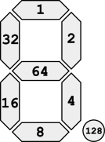

> Open this page at [https://devegied.github.io/pxt-tm1637/](https://devegied.github.io/pxt-tm1637/)

# Digit Display (TM1637)
makecode Digit Display (TM1637) extension for micro:bit

LED Digit Display Module with 1-6 (normal four) 7-segment LED, it can show numbers. It has TM1637 chip controled with a 2-wire interface.

Original author: shaoziyang https://github.com/makecode-extensions/TM1637

## Usage

In your micro:bit makecode project click on **Extensions** under the gearwheel menu
search for **https://github.com/devegied/pxt-tm1637** and import

## API

- **create(clk: DigitalPin, dio: DigitalPin, intensity: number, count: number)**
create a TM1637 object.
  - clk, any DigitalPin
  - dio, any DigitalPin
  - intensity, set display brightness, range [0-8]
  - count, digit count, range [1-6]

- **on()**
turn on the display.

- **off()**
turn off the display.

- **clear()**
clear content of the display.

- **showDigitAt(num: number, pos: number)**
show a digit in given position.

- **showNumber(num: number)**
show a interger number on display.

- **showHex(num: number)**
show a hex number on display.

- **showDP(pos: number, show: boolean)**
show or hide dot piont at given position
pos is dot point position, [0 - count]
show, True will show DP, False will hide it

- **intensity(val: number)**
set display brightness.

- **lightSegmentsAt(segments: number, pos: number)**
light indicated segments at given position
segments is display segments to light
pos is the position of the digit
segments value can be calculated by adding segmen values:

## Demo

## Blocks preview

This image shows the blocks code from the last commit in master.
This image may take a few minutes to refresh.

## License  

MIT

Copyright (c) 2018, [microbit/micropython Chinese community](http://www.micropython.org.cn)

#### Metadata (used for search, rendering)

* for PXT/microbit
